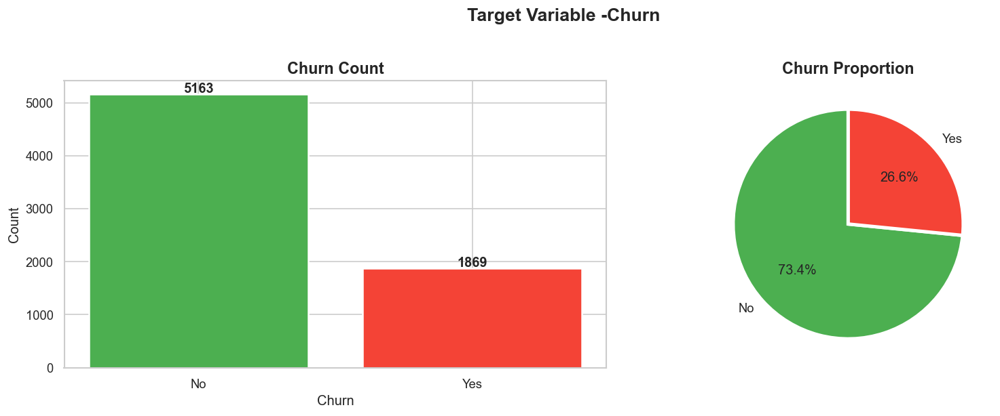
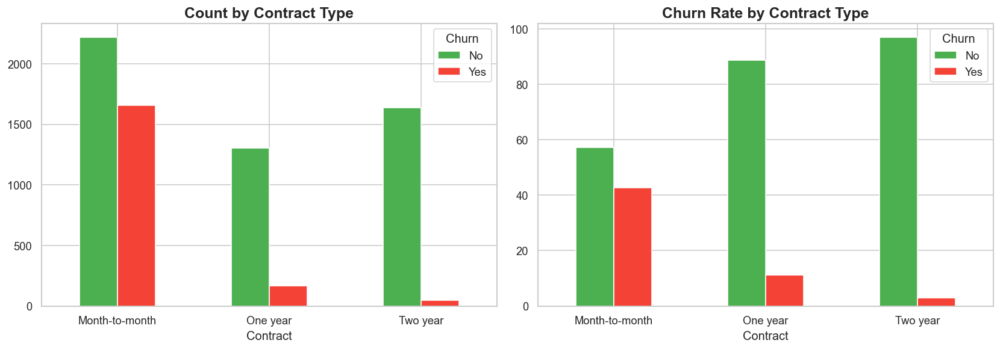
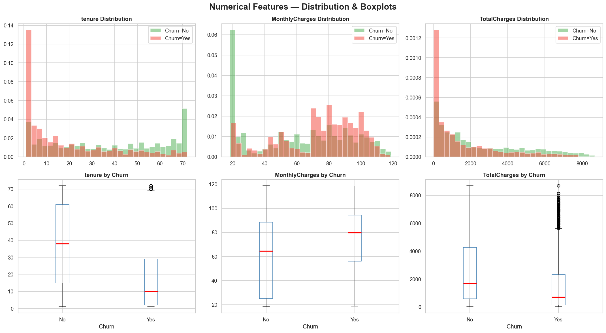
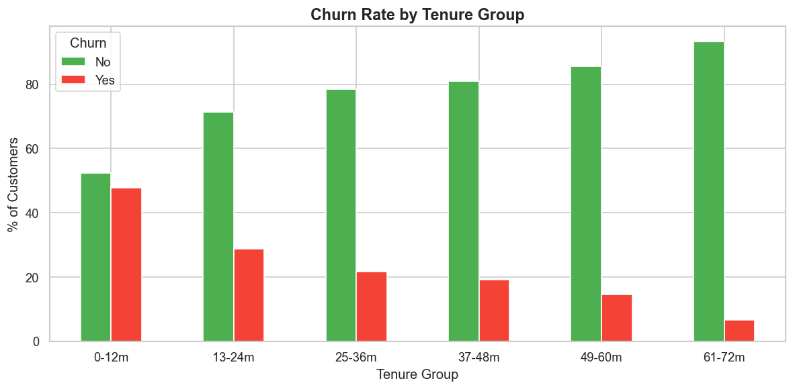

# 📉 Telco Customer Churn Prediction

An end-to-end Machine Learning project that predicts customer churn in a telecommunications company using the **Telco Customer Churn** dataset. The project covers the complete data science workflow—from business understanding and exploratory data analysis to data preprocessing, model development, hyperparameter tuning, and model interpretation.

---

## 📌 Project Overview

Customer retention is one of the most important challenges in the telecommunications industry. Acquiring new customers is significantly more expensive than retaining existing ones, making churn prediction a valuable business application.

In this project, I developed a machine learning model to identify customers who are likely to leave the company, enabling businesses to implement proactive retention strategies.

---

## 🎯 Business Problem

The objective is to predict whether a customer will churn based on demographic information, account details, subscribed services, and billing information.

**Business Goals**

- Identify customers at high risk of churn.
- Understand the key factors influencing customer churn.
- Enable targeted customer retention campaigns.
- Reduce customer acquisition costs by improving retention.

---

## 📂 Dataset

**Dataset:** Telco Customer Churn Dataset

**Source:** https://www.kaggle.com/datasets/blastchar/telco-customer-churn

**Dataset Summary**

- **Rows:** 7,043
- **Target Variable:** Churn (Yes / No)

### Main Features

- Customer Demographics
- Tenure
- Contract Type
- Internet Service
- Payment Method
- Monthly Charges
- Total Charges
- Additional Services

---

# 🛠️ Project Workflow

```
Business Understanding
        │
        ▼
Exploratory Data Analysis (EDA)
        │
        ▼
Data Cleaning
        │
        ▼
Feature Engineering
        │
        ▼
Encoding & Scaling
        │
        ▼
Train/Test Split
        │
        ▼
SMOTE (Class Balancing)
        │
        ▼
Model Training
        │
        ▼
Hyperparameter Tuning
        │
        ▼
Model Evaluation
        │
        ▼
Feature Interpretation
```

---

# 📁 Repository Structure

```
telco-customer-churn-analysis/
│
├── data/
│   ├── raw/
│   └── processed/
│
├── notebooks/
│   ├── 01_EDA.ipynb
│   ├── 02_Preprocessing.ipynb
│   └── 03_Modeling.ipynb
│
├── artifacts/
│   ├── best_model.pkl
│   ├── scaler.pkl
│   ├── feature_names.pkl
│   ├── X_train.csv
│   ├── X_test.csv
│   ├── y_train.csv
│   └── y_test.csv
│
├── images/
│
└── README.md
```

---

# 📊 Exploratory Data Analysis

The following visualizations summarize the most important findings from the exploratory data analysis.

---

## 1. Target Variable Distribution

<p align="center">
  
</p>

### 🔍 Insights

- The dataset is **imbalanced**, with **73.4%** of customers retained and **26.6%** having churned.
- Because the minority class is underrepresented, model training may become biased toward predicting non-churn customers.
- To address this issue, **SMOTE (Synthetic Minority Oversampling Technique)** was applied during preprocessing.
- Since the imbalance is moderate rather than severe, evaluation metrics such as **Recall**, **F1-score**, and **ROC-AUC** are more informative than Accuracy alone.

---

## 2. Churn Rate by Contract Type

<p align="center">
  
</p>

### 🔍 Insights

- Customers with **Month-to-Month contracts** exhibit the highest churn rate (approximately **43%**).
- Customers on **One-Year contracts** are considerably more loyal, with churn dropping to around **11%**.
- **Two-Year contracts** show the strongest customer retention, with only about **3%** churn.
- Longer contract commitments appear to substantially reduce churn risk, indicating that contract type is one of the strongest predictors of customer retention.

**Business Implication**

Encouraging customers to migrate from month-to-month plans to longer-term contracts could significantly improve customer retention.

---

## 3. Distribution of Numerical Features

<p align="center">
  
</p>

### 🔍 Insights

- Customers who churn generally have **shorter tenure**, indicating that churn is concentrated during the early stages of the customer lifecycle.
- Churned customers tend to have **higher monthly charges**, suggesting that expensive service plans may contribute to customer dissatisfaction.
- Non-churn customers typically accumulate **higher total charges**, reflecting longer customer relationships rather than higher spending.
- Several numerical variables contain outliers; however, these observations appear to represent legitimate customer behavior rather than data quality issues and were therefore retained.

**Business Implication**

Retention efforts should focus on newly acquired customers and those with relatively high monthly charges.

---

## 4. Churn Rate by Tenure Group

<p align="center">
  
</p>

### 🔍 Insights

- Customers within their **first 12 months** have the highest churn rate (nearly **48%**).
- Churn decreases consistently as customer tenure increases.
- Customers with more than **5 years of service** demonstrate very high loyalty, with churn falling below **10%**.
- Customer tenure shows a strong inverse relationship with churn, making it one of the most informative features for prediction.

**Business Implication**

The first year represents the highest-risk period in the customer lifecycle. Targeted onboarding programs, personalized support, and early engagement strategies could substantially improve customer retention.
The EDA focused on understanding customer behavior and identifying important churn patterns.

### Key Findings

- Customers within their **first year** have the highest churn rate.
- **Month-to-month contracts** are significantly more likely to churn.
- Customers using **Fiber Optic Internet** exhibit higher churn.
- Customers without value-added services (Online Security, Tech Support, Device Protection) are more likely to leave.
- Higher monthly charges are associated with increased churn.
- Long-term customers demonstrate substantially lower churn rates.

---

# ⚙️ Data Preprocessing

The preprocessing pipeline includes:

- Missing value handling
- Duplicate checking
- Feature engineering
- Binary Encoding
- One-Hot Encoding
- Standardization using StandardScaler
- Train-Test Split
- SMOTE for class balancing
- Saving preprocessing artifacts

### Feature Engineering

One additional features were created:

- **TenureGroup**

---

# 🤖 Machine Learning Models

The following classification algorithms were evaluated:

- Logistic Regression
- Random Forest
- Gradient Boosting
- XGBoost
- LightGBM
- Support Vector Machine (SVM)

Models were compared using **5-Fold Cross Validation** and evaluated on an unseen test dataset.

---

# 🏆 Best Model

**Logistic Regression**

It was selected because it provided the best overall balance of:

- ROC-AUC
- Precision
- Recall
- F1-score
- Interpretability
- Business usability

Hyperparameter tuning was performed using **GridSearchCV**.

---

# 📈 Evaluation Metrics

The models were evaluated using:

- Accuracy
- Precision
- Recall
- F1-Score
- ROC-AUC
- Confusion Matrix
- Precision-Recall Curve

---

# 📖 Model Interpretation

Instead of relying on coefficient magnitude, the project interprets the **direction of Logistic Regression coefficients**, since multicollinearity may make coefficient magnitudes unstable.

The interpretation focuses on:

- Features increasing churn risk
- Features reducing churn risk
- Business-friendly explanation of model behavior

---

# 💼 Business Insights

The analysis suggests several actionable strategies:

- Improve customer onboarding during the first year.
- Encourage migration from month-to-month to longer-term contracts.
- Offer retention incentives to high-risk customers.
- Bundle value-added services such as:
  - Online Security
  - Tech Support
  - Device Protection
- Monitor customers with high monthly charges for proactive engagement.

---

# 📌 Project Highlights

✔ End-to-End Machine Learning Pipeline

✔ Business-Oriented Analysis

✔ Feature Engineering

✔ Handling Imbalanced Data with SMOTE

✔ Hyperparameter Tuning

✔ Model Comparison

✔ ROC & Precision-Recall Analysis

✔ Explainable Logistic Regression

✔ Reproducible Workflow

---

# 🧰 Technologies Used

### Programming

- Python

### Data Manipulation

- Pandas
- NumPy

### Visualization

- Matplotlib
- Seaborn

### Machine Learning

- Scikit-learn
- XGBoost
- LightGBM
- imbalanced-learn (SMOTE)

### Model Persistence

- Joblib

### Development Environment

- Jupyter Notebook

---

# 🚀 Future Improvements

- Deploy the model using Streamlit.
- Build an interactive churn prediction dashboard.
- Implement SHAP values for advanced model explainability.
- Experiment with CatBoost and ensemble learning.
- Optimize decision thresholds based on business cost-benefit analysis.
- Perform probability calibration.

---

# 📚 Learning Outcomes

Through this project, I gained practical experience in:

- Business Problem Framing
- Exploratory Data Analysis
- Feature Engineering
- Data Preprocessing
- Handling Imbalanced Data
- Machine Learning Model Selection
- Hyperparameter Optimization
- Model Evaluation
- Business Interpretation of Results
- End-to-End Machine Learning Workflow

---

# 👨‍💻 Author

**Mukul Chandra Ray**

Aspiring Data Analyst | Statistics Graduate | Machine Learning Enthusiast

- GitHub: https://github.com/mukulray102
- LinkedIn: https://www.linkedin.com/in/mukul-ray-stat

---

## ⭐ If you found this project helpful, consider giving it a star!
